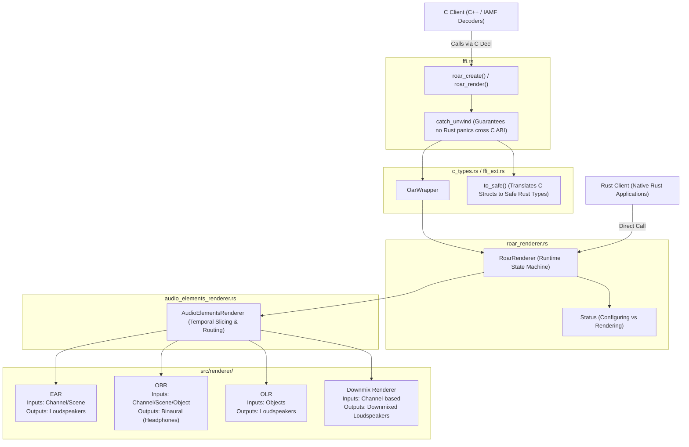

# ROAR (Rust Open Audio Renderer)

A Rust port of [Open Audio Renderer](https://github.com/AOMediaCodec/oar).

The library can be used to render various types of input audio into a
loudspeaker or binaural output.

## Building

### Prerequisites

-  Install [bazelisk](https://bazel.build/install/bazelisk) to run and manage bazel.

### Build

```shell
bazelisk build src:roar
```

### Run tests

```shell
bazelisk test src:roar_test  # unit tests
bazelisk test tests:all      # integration tests
bazelisk test equivalence_tests:all  # equivalence tests
bazelisk run -c opt equivalence_testing/benchmarks:benchmarks  # benchmarks
```

## Configuration

### Output configuration

Output is configured by `Config` (or `oar_config_t` for C) when the renderer
instance is created and contains the following:

-   `target_layout`: Output layout. Details below.
-   `samples_per_channel`: Buffer chunk size in samples (per channel).
-   `sampling_rate`: Sampling rate in Hz (e.g., 48000).

#### Valid output types

Output layouts are defined in `oar_layout_t` in `c_types.rs` for C++ or in the
`Layout` enum.

-   **Loudspeaker layouts**: From `ck_oar_layout_mono` to
    `ck_oar_layout_sound_system_g_490`.
-   **Binaural**: `ck_oar_layout_binaural`

#### Example

C++

```cpp
oar_config_t config;
config.target_layout = ck_oar_layout_514;
config.samples_per_channel = 1024;
config.sampling_rate = 48000;
```

Rust

```rust
let config = Config::new(
    Layout::Layout51,
    Samples::new(1024)?,
    SampleRate::new(48000)?,
)?;
```

### Input configuration

#### Audio groups

-   Every input audio element must belong to a group so one group is required,
    but ROAR can be also be configured with two groups.

-   Audio groups are analogous to the concept of IAMF sub-mixes, so having two
    groups allows applying gains to the group of elements, indepent of the other
    group.

##### Adding an audio group

C++

```cpp
// Add an audio group and get the ID (0 or 1)
int group_id = roar_add_audio_group(oar);
if (group_id < 0) {
  // Handle error (e.g. ck_oar_error_nomem or ck_oar_error_busy if max groups reached)
}
```

Rust

```rust
// Add group
let group_id = rdr.add_audio_group()?;
```

##### Configuring or updating a group

Groups can be configured by updating metadata.

Group metadata contains *one* of the following:

*   **Gain** (`oar_metadata_gain_t`): Dynamic output gain applied to the mixed
    group output. Can be constant, per-sample, or animated (in dB). Has an ID to
    identify the gain parameter.
*   **Head Rotation** (`quaternion_t`): Listener head orientation for binaural
    rendering (w, x, y, z).
    *   Expected to be a unit quaternion (sum of squares is 1.0).
    *   Uses the ADM coordinate system (positive X = right, positive Y = front,
        positive Z = up).
    *   Although updated via the group API, it applies globally to all binaural
        sub-renderers.

**Duration**: In the C API, a duration for head rotation is ignored. For gain
updates:

*   **C API**: A duration of `0` (or negative) is ignored (no-op).
*   **Rust API**: The duration is required (`Samples`).

Note: In the C API, the same metadata struct is used for updating both groups
and audio elements but groups can only accept gain and head rotation and audio
elements can only accept gain, object position, and demix/downmix mode. Object
positions and IAMF downmix modes are **element** metadata, not group metadata.

C++

```cpp
// 1. Update group gain (constant gain of -3.0 dB for 1024 samples)
oar_metadata_t gain_meta = {};
gain_meta.type = ck_metadata_gain;
gain_meta.duration = 1024;
gain_meta.gain.id = 1; // Unique ID for this gain parameter
gain_meta.gain.param_type = ck_param_constant;
gain_meta.gain.constant_gain = -3.0f;
roar_update_metadata(oar, group_id, &gain_meta);

// 2. Update head rotation (quaternion for 1024 samples)
oar_metadata_t rot_meta = {};
rot_meta.type = ck_metadata_head_rotation;
rot_meta.head_rotation.w = 1.0f;
rot_meta.head_rotation.x = 0.0f;
rot_meta.head_rotation.y = 0.0f;
rot_meta.head_rotation.z = 0.0f;
roar_update_metadata(oar, group_id, &rot_meta);
```

In the Rust API, there are separate APIs for updating the group gain and head
rotation:

Rust

```rust
// 1. Update group gain (constant gain of -3.0 dB for 1024 samples)
let gain = Gain::new_constant(Decibels(-3.0))?;
rdr.update_group_gain(group_id, &gain, Samples(1024))?;

// 2. Update head rotation (w, x, y, z quaternion).
// Head rotation is updated globally via set_head_rotation
rdr.set_head_rotation(Quaternion::identity())?;
```

Group loudness can also be modified:

C++

```cpp
roar_enable_loudness_processor(oar, 1); // Enable. It is default off.
roar_set_loudness(oar, group_id, current_loudness_db, target_loudness_db);
```

Rust

```rust
rdr.enable_loudness_processor(true)?;
rdr.set_loudness(group_id, current_loudness_db, target_loudness_db)?;
```

#### Audio elements

Note: Audio Element IDs (provided by the caller) must be unique across all audio
groups.

##### Creating audio elements

The Audio Element has the following configuration when created:

1.  Type
2.  Type-specific config
3.  Parameters

**Type-specific config**

Input Type    | Type-specific Config
:------------ | :--------------------------------------
Channel-based | `layout`: the layout of the input audio
Scene-based   | `order`: oar_hoa_t, 0 to 4
Object-based  | `num_objects`: 1 or 2

**Available Parameters**

Parameter                                       | Values
:---------------------------------------------- | :-----
*Downmix Info (only channel-based elements)*    |
mode                                            | Values from the [IAMF spec]
weight_index                                    | Index into the [mapping table]
*Rendering Config (only for binaural elements)* |
headphones_rendering_mode                       | stereo, world-locked, or head-locked
binaural_filter_profile                         | ambient, direct, or reverberant

[IAMF spec]: https://aomediacodec.github.io/iamf/#dmixp_mode
[mapping table]: https://aomediacodec.github.io/iamf/#widx-k

Note: Using `ck_world_locked_restricted` (C API) or `WorldLockedRestricted`
(Rust API) means that element is rendered to stereo, not binaural.

C++

```cpp
oar_audio_element_config_t elem_cfg = {};

// Example 1: Channel-based element (Stereo) with headphones rendering config
elem_cfg.type = ck_channel_based;
elem_cfg.cbc.layout = ck_oar_layout_stereo;
elem_cfg.parameters.flags = def_parameter_set_flag_iamf_element_rendering_config;
elem_cfg.parameters.element_rendering_config.headphones_rendering_mode = ck_world_locked; // or ck_head_locked
elem_cfg.parameters.element_rendering_config.binaural_filter_profile = ck_binaural_filter_profile_default;

uint32_t element_id = 42;
roar_add_audio_element(oar, group_id, element_id, &elem_cfg);

// Example 2: Channel-based element (5.1) with Downmix Info
oar_audio_element_config_t downmix_elem_cfg = {};
downmix_elem_cfg.type = ck_channel_based;
downmix_elem_cfg.cbc.layout = ck_oar_layout_51;
downmix_elem_cfg.parameters.flags = def_parameter_set_flag_iamf_downmix_info;
downmix_elem_cfg.parameters.downmix_info.mode = 0; // IAMF downmix mode 0
downmix_elem_cfg.parameters.downmix_info.weight_index = 0;

roar_add_audio_element(oar, group_id, element_id + 1, &downmix_elem_cfg);
```

Rust

```rust
let rendering_cfg = ElementRenderingConfig {
    headphones_rendering_mode: HeadphonesRenderingMode::WorldLocked, // or HeadLocked
    binaural_filter_profile: BinauralFilterProfile::Ambient, // or Direct, Reverberant
};
let elem_cfg = AudioElementConfig::ChannelBased(ChannelBasedConfig {
    layout: Layout::Stereo,
    downmix_info: None,
    rendering_config: Some(rendering_cfg),
});
rdr.add_element(group_id, element_id, &elem_cfg)?;
```

##### Updating Audio

*   Audio elements can be removed by ID.
*   Input audio data is provided by ID.
*   Elements can be updated with dynamic metadata:
    *   **Gain** (`oar_metadata_gain_t`): Dynamic element volume control
        (applies to all element types).
    *   **Object Positions** (`oar_metadata_object_positions_t`): Polar or
        Cartesian coordinates, both static and animated (applies to object-based
        elements only). See below for details.
    *   **Downmix Mode** (`oar_metadata_iamf_downmix_mode_t`): Dynamic downmix
        mode override (applies to channel-based with downmix only).

**Duration**: Downmix Mode supports optional duration. `0` (C) or `None` (Rust)
indicates the update should persist indefinitely. Gain and Object Positions
updates require duration. *In the C API, a duration of `0` (or negative) means
the metadata update is ignored!*

Note: In the C API, the same metadata struct is used for groups and audio
elements but groups can only accept gain and head rotation and audio elements
can only accept gain, object position, and demix/downmix mode.

**Object position** Object position can be static or animated, in either Polar
or Cartesian systems:

*   **Static vs animated**: Static positions keep the object fixed in place.
    Animated positions specify a trajectory (linear, step, or Bezier) over a
    duration.
*   **Coordinate systems and expected ranges**:
    *   **Polar coordinate system**:
        *   `azimuth`: Horizontal angle in degrees, range `[-180.0, 180.0]`
            (0° = front, 90° = left, -90° = right, ±180° = behind).
        *   `elevation`: Vertical angle in degrees, range `[-90.0, 90.0]` (0° =
            horizon, 90° = above, -90° = below).
        *   `distance`: Normalized distance from listener, range `[0.0, 1.0]`.
    *   **Cartesian coordinate system (ADM object coordinates)**:
        *   `x`: Left (negative) / Right (positive) in `[-1.0, 1.0]`.
        *   `y`: Back (negative) / Front (positive) in `[-1.0, 1.0]`.
        *   `z`: Down (negative) / Up (positive) in `[-1.0, 1.0]`.
        *   Note: Cartesian magnitudes (vector distances) greater than 1.0 are
            clamped to 1.0 during polar conversion.
*   **Evaluation of animated gains**: The core OBR and OLR DSP renderers only
    accept static polar coordinates. To render dynamic movement, the library's
    outer routing layer (`AudioElementsRenderer`) splits the audio block into
    smaller intervals of size `metadata_unit_to_process`, configured via
    `roar_set_metadata_unit_to_process` (defaulting to the audio block size
    `samples_per_channel` configured at creation). For each render, the router
    calculates the snapshot position along the animation trajectory, flattens
    Cartesian coordinates to Polar, and updates the sub-renderer with the
    resulting static polar coordinates before rendering the sub-frame.
*   **Animation smoothness**: Choosing a smaller `metadata_unit_to_process`
    (e.g., 64 samples) increases the "frame rate" of position updates, producing
    smoother spatial transitions at the cost of additional sub-renderer metadata
    updates.

C++

```cpp
// 1. Update element gain (constant gain of -1.5 dB for 1024 samples)
oar_metadata_t gain_meta = {};
gain_meta.type = ck_metadata_gain;
gain_meta.duration = 1024;
gain_meta.gain.id = 1;
gain_meta.gain.param_type = ck_param_constant;
gain_meta.gain.constant_gain = -1.5f;
roar_update_audio_element_metadata(oar, element_id, &gain_meta);

// 2. Update object positions (if element is object-based)
oar_metadata_t pos_meta = {};
pos_meta.type = ck_metadata_object_positions;
pos_meta.duration = 1024;
pos_meta.object_positions.param_type = ck_param_constant;
pos_meta.object_positions.position_type = ck_polar;
pos_meta.object_positions.num_objects = 1;
pos_meta.object_positions.polar_positions[0].azimuth = 30.0f;
pos_meta.object_positions.polar_positions[0].elevation = 0.0f;
pos_meta.object_positions.polar_positions[0].distance = 1.0f;
roar_update_audio_element_metadata(oar, object_element_id, &pos_meta);

// 3. Update downmix mode (if element is channel-based and using downmix)
oar_metadata_t dmix_meta = {};
dmix_meta.type = ck_metadata_iamf_downmix_mode;
dmix_meta.duration = 1024;
dmix_meta.iamf_downmix_mode.mode = 1; // Switch to downmix mode 1
roar_update_audio_element_metadata(oar, channel_element_id, &dmix_meta);

// 4. Provide audio data block
oar_audio_block_t input_block;
input_block.channels = 2;
input_block.samples_per_channel = 1024;
input_block.data = planar_input_floats; // Pointer to (channels * samples) floats
roar_update_audio_element_data(oar, element_id, &input_block);

// 5. Remove the element
roar_remove_audio_element(oar, element_id);
```

Rust

```rust
// 1. Update element gain (constant gain of -1.5 dB for 1024 samples)
let gain = Gain::new_constant(Decibels(-1.5))?;
let gain_id = 1;
rdr.update_element_gain(element_id, gain_id, &gain, Samples(1024))?;

// 2. Update object positions (if element is object-based)
let polar = PolarCoordinate::new_from_floats(30.0f32, 0.0f32, 1.0f32)?;
let positions = ObjectPosition::Polar(vec![polar]);
rdr.update_element_positions(object_element_id, &positions, Samples(1024))?;

// 3. Update downmix mode (if element is channel-based and using downmix)
rdr.update_element_downmix_mode(
    channel_element_id, DownmixMode::Mode2NegOffset, Some(Samples(1024)))?;

// Note: In Rust, audio inputs are not registered beforehand via a data block.
// Instead, they are passed as a slice of references directly in the render call:
// rdr.render(&inputs, &mut output)?;

// 4. Remove the element
rdr.remove_element(element_id)?;
```

### Additional renderer settings

These settings are supported in both C/C++ and Rust APIs.

#### Output peak limiter.

C++

```cpp
roar_enable_limiter(oar, 1); // Enable
```

Rust

```rust
rdr.enable_limiter(true)?;
```

#### Head Tracking

Enables head tracking for binaural rendering. Enable if you will provide head
rotation information for the user's head to enable world-locked binaural audio.

C++

```cpp
roar_enable_head_tracking(oar, 1); // Enable
```

Rust

```rust
rdr.enable_head_tracking(true)?;
```

## Examples

### Simple usage (7.1.4 to 5.1 output)

C/C++

```cpp
// Example config for 5.1 output.
oar_config_t config;
config.target_layout = ck_oar_layout_51;
config.samples_per_channel = 1024;
config.sampling_rate = 48000;

// Create an instance of OAR.
oar_t* oar = roar_create(&config);
if (!oar) {
  // Handle failure
}

// Add an audio group
int group_id = roar_add_audio_group(oar);
if (group_id < 0) {
  // Handle failure
}

// Configure a 7.1.4 channel-based audio element (12 channels)
oar_audio_element_config_t element_config = {};
element_config.type = ck_channel_based;
element_config.cbc.layout = ck_oar_layout_714;
// Configure with downmix parameters to enable downmix renderer
element_config.parameters.flags = def_parameter_set_flag_iamf_downmix_info;
element_config.parameters.downmix_info.mode = 0;
element_config.parameters.downmix_info.weight_index = 0;

uint32_t element_id = 42;
int return_code = roar_add_audio_element(oar, group_id, element_id, &element_config);
if (return_code != 0) {
  // Handle failure
}

// Fill the input data (12 channels * 1024 samples planar).
// The input data should not be destroyed before render is called.
oar_audio_block_t input_block;
input_block.channels = 12;
input_block.samples_per_channel = 1024;
input_block.data = input_buffer_ptr; // float*

return_code = roar_update_audio_element_data(oar, element_id, &input_block);
if (return_code != 0) {
  // Handle failure
}

// Create output struct with space for 5.1 output (6 channels * 1024 samples planar)
oar_audio_block_t output_block;
output_block.channels = 6;
output_block.samples_per_channel = 1024;
output_block.data = output_buffer_ptr; // float*

// Render.
// This example only has one render call (and one set of inputs/outputs), but
// a real application would repeatedly call `roar_update_audio_element_data` and
// `roar_render`.
return_code = roar_render(oar, &output_block);
if (return_code != 0) {
  // Handle failure
}

// Clean up
roar_destroy(oar);
```

Rust

```rust
use roar::common::definitions::{
    Config, Layout, AudioElementConfig, ChannelBasedConfig, OarError, Samples,
    PlanarBufferRef, PlanarBufferMut, SampleRate
};
use roar::renderer::RoarRenderer;

fn render_audio() -> Result<(), OarError> {
    let config = Config::new(
        Layout::Layout51,
        Samples::new(1024)?,
        SampleRate::new(48000)?,
    )?;

    // Create renderer (Configuring status)
    let mut rdr = RoarRenderer::create(&config)?;

    // Add audio group
    let group_id = rdr.add_audio_group()?;

    // Configure and add audio element
    let element_cfg = AudioElementConfig::ChannelBased(ChannelBasedConfig {
        layout: Layout::Stereo,
        downmix_info: None,
        rendering_config: None,
    });
    let element_id = 42;
    rdr.add_element(group_id, element_id, &element_cfg)?;

    // Transition to rendering state (optional, render() will call it automatically)
    rdr.init_rendering()?;

    // Fill input data (planar format: slice of channel slices)
    let input_ch0 = vec![0.0f32; 1024];
    let input_ch1 = vec![0.0f32; 1024];
    let input_slices = [&input_ch0[..], &input_ch1[..]];
    let inputs = [
        (element_id, PlanarBufferRef::Slices(&input_slices[..]))
    ];

    // Prepare output buffer (planar format: 5.1 target has 6 channels)
    let mut output_data = vec![0.0f32; 6 * 1024];
    let mut output = PlanarBufferMut::Flat {
        data: &mut output_data,
        num_channels: 6,
        samples_per_channel: 1024,
    };

    // Render
    // This example only has one render call (and one set of inputs/outputs),
    // but a real application would repeatedly call
    // `roar_update_audio_element_data` and `roar_render`.
    rdr.render(&inputs, &mut output)?;
    Ok(())
}
```

### Ambisonic input example

C++

```cpp
// 1. Create OAR config for Stereo loudspeaker output
oar_config_t config;
config.target_layout = ck_oar_layout_stereo;
config.samples_per_channel = 1024;
config.sampling_rate = 48000;
oar_t* oar = roar_create(&config);
int group_id = roar_add_audio_group(oar);

// 2. Add scene-based (1OA) audio element (4 channels)
oar_audio_element_config_t elem_cfg = {};
elem_cfg.type = ck_scene_based;
elem_cfg.sbc.order = ck_oar_1oa;

uint32_t element_id = 200;
roar_add_audio_element(oar, group_id, element_id, &elem_cfg);

// 3. Provide 4-channel input data block (planar)
oar_audio_block_t input_block;
input_block.channels = 4;
input_block.samples_per_channel = 1024;
input_block.data = ambisonic_audio_ptr; // float*
roar_update_audio_element_data(oar, element_id, &input_block);

// 4. Render to Stereo output (2 channels)
oar_audio_block_t output_block;
output_block.channels = 2;
output_block.samples_per_channel = 1024;
output_block.data = output_buffer_ptr; // float*
roar_render(oar, &output_block);

roar_destroy(oar);
```

Rust

```rust
// 1. Create config for Stereo loudspeaker output
let config = Config::new(
    Layout::Stereo,
    Samples::new(1024)?,
    SampleRate::new(48000)?,
)?;
let mut rdr = RoarRenderer::create(&config)?;
let group_id = rdr.add_audio_group()?;

// 2. Add scene-based (1OA) audio element
let elem_cfg = AudioElementConfig::SceneBased(SceneBasedConfig {
    order: HighOrderAmbisonics::Order1,
    rendering_config: None,
});
let element_id = 200;
rdr.add_element(group_id, element_id, &elem_cfg)?;

// 3. Prepare inputs (4 channels * 1024 samples planar)
let inputs = [
    (element_id, PlanarBufferRef::Slices(&input_channels[..]))
];

// Prepare output buffer (planar format: Stereo has 2 channels)
let mut output_data = vec![0.0f32; 2 * 1024];
let mut output = PlanarBufferMut::Flat {
    data: &mut output_data,
    num_channels: 2,
    samples_per_channel: 1024,
};

// 4. Render
rdr.render(&inputs, &mut output)?;
```

### Moving object usage

C++

```cpp
// 1. Create OAR config for 5.1 loudspeaker output
oar_config_t config;
config.target_layout = ck_oar_layout_51;
config.samples_per_channel = 1024;
config.sampling_rate = 48000;
oar_t* oar = roar_create(&config);
int group_id = roar_add_audio_group(oar);

// 2. Add object-based audio element (1 object)
oar_audio_element_config_t elem_cfg = {};
elem_cfg.type = ck_object_based;
elem_cfg.obc.num_objects = 1;

uint32_t element_id = 100;
roar_add_audio_element(oar, group_id, element_id, &elem_cfg);

// 3. Render loop with dynamic position updates
float current_azimuth = -90.0f;
while (rendering) {
  // Update object position (panning from left to right)
  oar_metadata_t pos_meta = {};
  pos_meta.type = ck_metadata_object_positions;
  pos_meta.duration = 1024;
  pos_meta.object_positions.param_type = ck_param_constant;
  pos_meta.object_positions.position_type = ck_polar;
  pos_meta.object_positions.num_objects = 1;
  pos_meta.object_positions.polar_positions[0].azimuth = current_azimuth;
  pos_meta.object_positions.polar_positions[0].elevation = 0.0f;
  pos_meta.object_positions.polar_positions[0].distance = 1.0f;
  roar_update_audio_element_metadata(oar, element_id, &pos_meta);

  // Provide mono input block for the object
  oar_audio_block_t input_block;
  input_block.channels = 1;
  input_block.samples_per_channel = 1024;
  input_block.data = object_audio_ptr; // float*
  roar_update_audio_element_data(oar, element_id, &input_block);

  // Render to 5.1 output (6 channels)
  oar_audio_block_t output_block;
  output_block.channels = 6;
  output_block.samples_per_channel = 1024;
  output_block.data = output_buffer_ptr; // float*
  roar_render(oar, &output_block);

  current_azimuth += 1.0f;
  if (current_azimuth > 90.0f) current_azimuth = -90.0f;
}

roar_destroy(oar);
```

Rust

```rust
// 1. Create config for 5.1 loudspeaker output
let config = Config::new(
    Layout::Layout51,
    Samples::new(1024)?,
    SampleRate::new(48000)?,
)?;
let mut rdr = RoarRenderer::create(&config)?;
let group_id = rdr.add_audio_group()?;

// 2. Add object-based audio element (1 object)
let elem_cfg = AudioElementConfig::ObjectBased(ObjectBasedConfig {
    num_objects: 1,
    rendering_config: None,
});
let element_id = 100;
rdr.add_element(group_id, element_id, &elem_cfg)?;

// 3. Render loop with dynamic position updates
let mut current_azimuth = -90.0f32;
while rendering {
    // Update object position (panning from left to right)
    let polar = PolarCoordinate::new_from_floats(current_azimuth, 0.0f32, 1.0f32)?;
    let positions = ObjectPosition::Polar(vec![polar]);
    rdr.update_element_positions(element_id, &positions, Some(Samples(1024)))?;

    // Prepare inputs (1 channel * 1024 samples planar)
    let inputs = [
        (element_id, PlanarBufferRef::Slices(&object_audio[..]))
    ];

    // Prepare output buffer (planar format: 6 channels for 5.1)
    let mut output_data = vec![0.0f32; 6 * 1024];
    let mut output = PlanarBufferMut::Flat {
        data: &mut output_data,
        num_channels: 6,
        samples_per_channel: 1024,
    };

    // Render to 5.1
    rdr.render(&inputs, &mut output)?;

    current_azimuth += 1.0f32;
    if current_azimuth > 90.0f32 {
        current_azimuth = -90.0f32;
    }
}
```

### Binaural output with head tracking

C++

```cpp
// 1. Create OAR config for Binaural output
oar_config_t config;
config.target_layout = ck_oar_layout_binaural;
config.samples_per_channel = 1024;
config.sampling_rate = 48000;
oar_t* oar = roar_create(&config);
int group_id = roar_add_audio_group(oar);

// 2. Add 5.1.4 channel-based audio element (10 channels) configured for world-locked rendering
oar_audio_element_config_t elem_cfg = {};
elem_cfg.type = ck_channel_based;
elem_cfg.cbc.layout = ck_oar_layout_514;
elem_cfg.parameters.flags = def_parameter_set_flag_iamf_element_rendering_config;
elem_cfg.parameters.element_rendering_config.headphones_rendering_mode = ck_world_locked;
elem_cfg.parameters.element_rendering_config.binaural_filter_profile = ck_binaural_filter_profile_default;

uint32_t element_id = 101;
roar_add_audio_element(oar, group_id, element_id, &elem_cfg);

// 3. Enable head tracking
roar_enable_head_tracking(oar, 1);

// 4. Render loop with head rotation updates
while (rendering) {
  // Update head rotation from sensor data
  oar_metadata_t rot_meta = {};
  rot_meta.type = ck_metadata_head_rotation;
  rot_meta.duration = 1024;
  rot_meta.head_rotation.w = sensor_q.w;
  rot_meta.head_rotation.x = sensor_q.x;
  rot_meta.head_rotation.y = sensor_q.y;
  rot_meta.head_rotation.z = sensor_q.z;
  // Head rotation is updated via the group API
  roar_update_metadata(oar, group_id, &rot_meta);

  // Provide 5.1.4 input data block
  oar_audio_block_t input_block;
  input_block.channels = 10;
  input_block.samples_per_channel = 1024;
  input_block.data = input_audio_ptr; // float*
  roar_update_audio_element_data(oar, element_id, &input_block);

  // Render to Binaural (2 channels)
  oar_audio_block_t output_block;
  output_block.channels = 2;
  output_block.samples_per_channel = 1024;
  output_block.data = output_buffer_ptr; // float*
  roar_render(oar, &output_block);
}

roar_destroy(oar);
```

Rust

```rust
// 1. Create OAR config for Binaural output
let config = Config::new(
    Layout::Binaural,
    Samples::new(1024)?,
    SampleRate::new(48000)?,
)?;
let mut rdr = RoarRenderer::create(&config)?;
let group_id = rdr.add_audio_group()?;

// 2. Add 5.1.4 channel-based audio element (10 channels) configured for world-locked rendering
let rendering_cfg = ElementRenderingConfig {
    headphones_rendering_mode: HeadphonesRenderingMode::WorldLocked,
    binaural_filter_profile: BinauralFilterProfile::Ambient,
};
let elem_cfg = AudioElementConfig::ChannelBased(ChannelBasedConfig {
    layout: Layout::Layout514,
    downmix_info: None,
    rendering_config: Some(rendering_cfg),
});
let element_id = 101;
rdr.add_element(group_id, element_id, &elem_cfg)?;

// 3. Enable head tracking
rdr.enable_head_tracking(true)?;

// 4. Render loop with head rotation updates
while rendering {
    // Update head rotation from sensor data
    rdr.set_head_rotation(sensor_quaternion)?;

    // Prepare inputs (10 channels * 1024 samples planar)
    let inputs = [
        (element_id, PlanarBufferRef::Slices(&input_channels[..]))
    ];

    // Prepare output buffer (planar format: Binaural has 2 channels)
    let mut output_data = vec![0.0f32; 2 * 1024];
    let mut output = PlanarBufferMut::Flat {
        data: &mut output_data,
        num_channels: 2,
        samples_per_channel: 1024,
    };

    // Render to Binaural (2 channels)
    rdr.render(&inputs, &mut output)?;
}
```

## Implementation details

### Library architecture

Via the C or Rust API, ROAR is structured into five main layers.

1.  **C API Entrypoint (`ffi.rs`)**: Exposes `#[unsafe(no_mangle)] extern "C"`
    functions matching the original OAR C specification. It catches Rust panics
    and translates errors to integer status codes.
2.  **Safe State & Type Translation (`c_types.rs` / `ffi_ext.rs`)**: Conversions
    validate C inputs and instantiate safe Rust types.
3.  **Rust Orchestrator (`roar_renderer.rs`)**: Uses a runtime state machine
    (`Status`) to manage transition from configuration to rendering, ensuring
    eager allocation of sub-renderers before rendering starts.
4.  **Routing & Slicing (`audio_elements_renderer.rs`)**: Manages routing of
    active elements, applying sub-frame temporal block slicing and dynamic
    metadata interpolation.
5.  **DSP Backends**: Concrete renderers (EAR, OBR, OLR, Downmix) performing
    actual DSP calculations. All backends implement the `AudioRenderer` trait.



### Renderers

#### Summary table

Name                                | Directory               | Used for input types                     | Used for output types
:---------------------------------- | :---------------------- | :--------------------------------------- | :--------------------
**EAR**                             | `src/renderer/ear/`     | Channel-based, Scene-based               | Loudspeaker (including world-locked restricted)
**Open Binaural Renderer (OBR)**    | `src/renderer/obr/`     | Channel-based, Scene-based, Object-based | Binaural
**Open Loudspeaker Renderer (OLR)** | `src/renderer/olr/`     | Object-based                             | Loudspeaker
**Downmix**                         | `src/renderer/downmix/` | Channel-based                            | Loudspeaker

##### Selection logic and downmix parameter behavior

The active internal renderer is selected during initialization based on the
target output layout and the configuration of the audio elements:

-   Binaural output (`ck_oar_layout_binaural`)
    -   **OBR** is always selected for all input types. For channel-based
        inputs, virtual speaker encoding is performed before decoding to
        binaural.
-   Loudspeaker output
    -   Scene-based input: **EAR** is always used.
    -   Object-based input: **OLR** is always selected.
    -   Channel-based input: Selection depends on the downmix configuration:
        -   **Downmix renderer** is selected if:
            1.  Downmix information is provided in the element parameters
                (`def_parameter_set_flag_iamf_downmix_info` is set).
            2.  The input layout and target layout form a supported downmix
                combination.
        -   **EAR** is selected as a fallback if the above conditions are not
            met.

### FFT usage

ROAR uses the following Rust FFT libraries for frequency-domain processing in
OBR:

-   [`rustfft`](https://crates.io/crates/rustfft): A high-performance,
    standards-compliant FFT library written in pure Rust.
-   [`realfft`](https://crates.io/crates/realfft): A wrapper around `rustfft`
    specifically optimized for real-to-complex and complex-to-real FFTs, which
    cuts processing time and memory usage in half compared to complex-to-complex
    FFTs.

The `FftManager` in OBR pre-allocates all necessary plans and scratch buffers
during initialization to ensure zero heap allocation on the audio thread during
real-time rendering.

### SIMD usage

ROAR does not use explicit, platform-specific SIMD intrinsics (such as x86
AVX/SSE or ARM NEON). Instead, it relies on:

1.  Compiler Autovectorization: The vector math operations (e.g., in
    `simd_utils.rs` for OBR) are written as simple, contiguous slice loops with
    bounds checks elided where possible. This allows LLVM to automatically
    generate optimal SIMD instructions for the target architecture during
    release builds.
2.  Library-Level SIMD: The underlying `rustfft` library contains its own
    architecture-specific SIMD implementations (supporting AVX, SSE, and NEON)
    which are automatically used when compiling for supported platforms.
